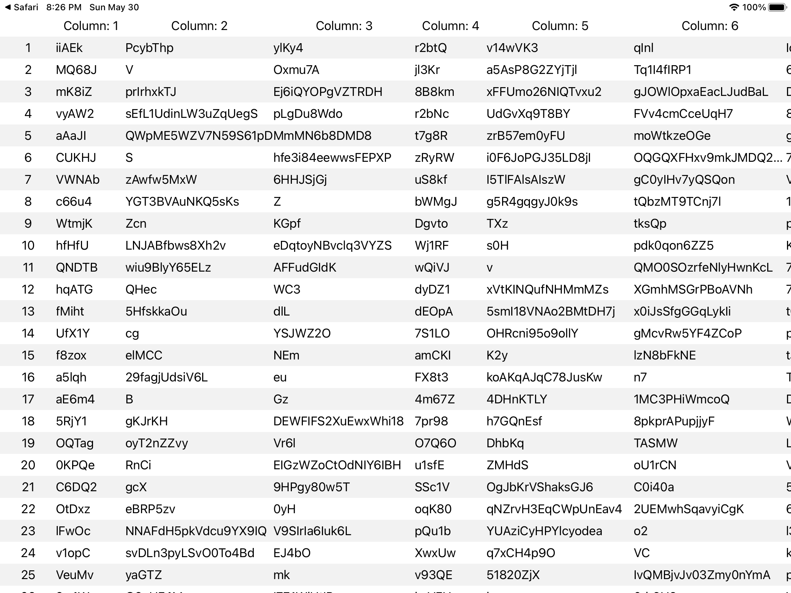

# RDSpreadsheet

iOS UI componet that allows to present data as a spreadsheet.

## Features

* Present data as a spreadsheet.
* Scroll the spreadsheet horizontally and vertically.
* Smoothly works for 100x100 cells table.
* Stick the first row and the first column.
* Copy a cell's text to the clipboard.
* Present a toast.

## Dependencies

* RDRandom
* RDUIKit

## Screenshots



## Usage

* Add to you project

```swift
.package(
    name: "RDSpreadsheet",
    url: "git@github.com:drrost/rd-spreadsheet.git"
    .exact("0.0.2")),
```

* Add to your view controller:

```swift
import RDSpreadsheet

// ...

override func viewDidLoad() {
    super.viewDidLoad()

    let dataService = DataServiceImpl()
    let spreadsheetVC = SpreadsheetVC.create(dataService)
    navigationController?.pushViewController(spreadsheetVC, animated: false)
}
```

where `DataServiceImpl` is an implementation of `IDataService` protocol.
